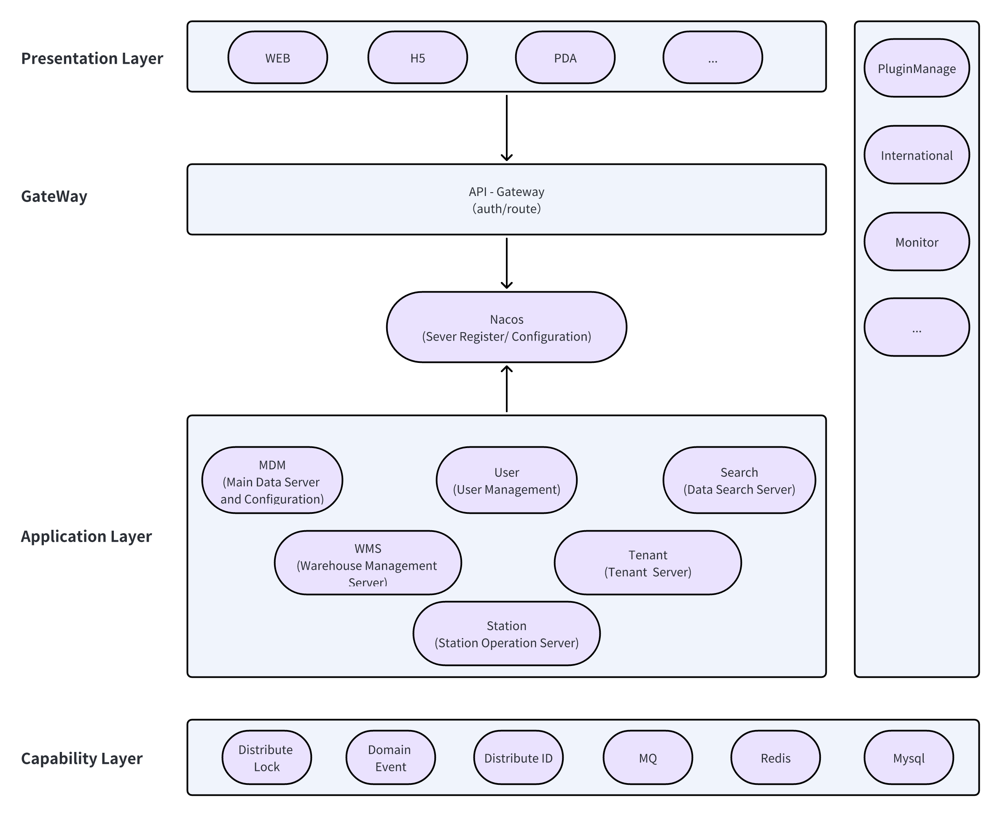

# SWMS

A Saas system about warehouse management

## Require environment

1. Jdk 17
2. gradle 8.0+
3. nacos 2.0+
4. redis 5.0+
5. mysql 8.0+

## How to run this system

1. Install middlewares: nacos, redis, mysql
2. execute the script in the /script folder into mysql
3. update the ip,port in the nacos and swms_tenant database
4. start servers in the /server

## Architecture

